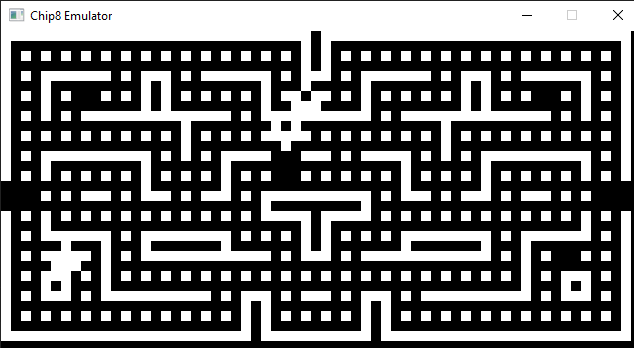
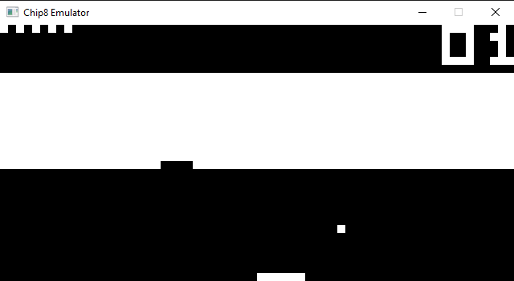

# CHIP-8 Emulator

This project is a simple introduction to emulation. 

It follows a virtual CPU architecture, named CHIP-8, and allows you to play CHIP-8 games. The screen is a simple black and white
screen, rendering a window of size 64x32 pixels. 

It was written in C, using SDL to render the screen.

## Use

### Build with CMake

This project now supports cross-platform CMake builds (You need SDL2 to have the build work).


Requirements:
- C compiler with C11 support
- SDL2 development package
- CMake 3.16+

Build steps:
```bash
cmake -S . -B build
cmake --build build
```

Run:
```bash
./build/chip8_emulator
```

Notes:
- Linux (Debian/Ubuntu): install `libsdl2-dev`
- Fedora: install `SDL2-devel`
- macOS (Homebrew): `brew install sdl2`
- Windows (vcpkg): `vcpkg install sdl2` and configure CMake with your vcpkg toolchain file




